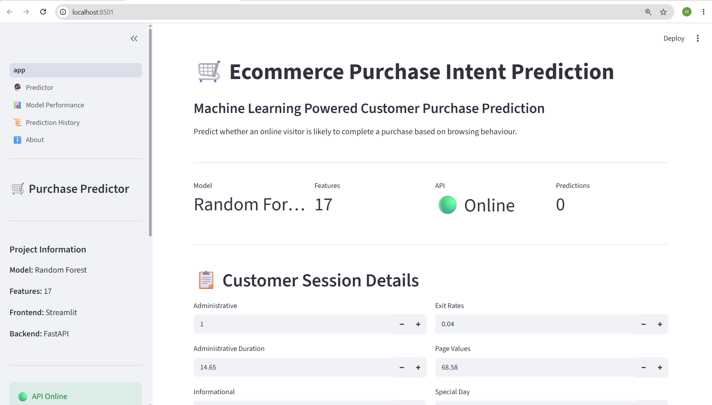
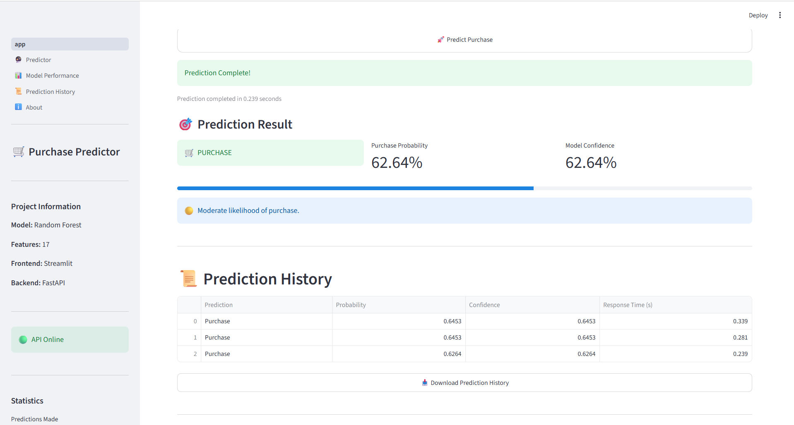

# 🛒 Ecommerce Purchase Intent Prediction

> End-to-End Machine Learning Project for predicting customer purchase intent using Explainable AI, FastAPI, Streamlit, and MLflow.

## 📌 Project Overview

This project predicts whether an online customer session will result in a purchase using Machine Learning.

The application combines a Random Forest Classifier with a FastAPI backend and an interactive Streamlit dashboard to deliver real-time purchase predictions along with model explainability using SHAP and LIME.

---

# 📸 Dashboard Preview

## 🏠 Home Dashboard



---

## 🎯 Purchase Prediction


---

## 📜 Prediction History



---

## 📊 SHAP Summary Plot


---

## ⭐ SHAP Feature Importance


---

## 🔍 SHAP Local Explanation


---

## 🟢 LIME Local Explanation


---
## 🎯 Business Problem

E-commerce businesses receive thousands of visitors every day, but only a small percentage complete a purchase.

Being able to predict customer purchase intent enables businesses to:

- Improve conversion rates
- Personalize customer experiences
- Target marketing campaigns effectively
- Reduce advertising costs
- Increase overall revenue

# 🚀 Features

- Real-time purchase prediction
- FastAPI REST API
- Interactive Streamlit Dashboard
- Prediction history
- Analytics dashboard
- Model performance comparison
- SHAP Feature Importance
- SHAP Local Explanation
- MLflow Experiment Tracking
- Download prediction history
- Production-ready project structure

---

## 🛠 Technology Stack

| Category | Tools |
|-----------|------|
| Programming | Python |
| Data Analysis | Pandas, NumPy |
| Visualization | Matplotlib, Plotly |
| Machine Learning | Scikit-Learn |
| Explainable AI | SHAP |
| API | FastAPI |
| Dashboard | Streamlit |
| Experiment Tracking | MLflow |
| Version Control | Git & GitHub |

---


## 📊 Model Performance

| Model | Accuracy | Precision | Recall | F1 Score | ROC-AUC |
|------|---------:|----------:|--------:|---------:|---------:|
| Logistic Regression | 92.96% | 83.99% | 68.17% | 75.26% | 96.27% |
| Decision Tree | 89.25% | 65.62% | 66.31% | 65.96% | 79.92% |
| ⭐ Random Forest | **93.17%** | **81.23%** | **73.47%** | **77.16%** | **96.91%** |
---

## 📂 Project Structure

```text
Ecommerce-Purchase-Intent-Prediction/
│
├── dashboard/                # Streamlit dashboard
├── data/
│   ├── raw/
│   ├── processed/
│   └── data_dictionary.csv
│
├── docs/                     # Documentation
├── images/                   # README screenshots
├── models/
│   ├── best_random_forest.pkl
│   ├── scaler.pkl
│   ├── label_encoders.pkl
│   └── feature_columns.json
│
├── notebooks/
│   ├── 01_Data_Preprocessing.ipynb
│   ├── 02_EDA.ipynb
│   ├── 03_Model_Training.ipynb
│   ├── 04_Model_Explainability.ipynb
│   └── 05_Deployment.ipynb
│
├── src/
│   ├── api/
│   ├── models/
│   └── utils/
│
├── .gitignore
├── README.md
└── requirements.txt
```

# ⚙ Installation

Clone the repository

```bash
git clone <repository-url>
```

Create virtual environment

```bash
python -m venv venv
```

Activate environment

Windows

```bash
venv\Scripts\activate
```

Install dependencies

```bash
pip install -r requirements.txt
```

---

# ▶ Run FastAPI

```bash
uvicorn src.api.main:app --reload
```

---

# ▶ Run Streamlit Dashboard

```bash
streamlit run dashboard/app.py
```

---

# 📈 Dashboard Features

- Purchase Prediction
- API Status
- Prediction History
- Analytics Dashboard
- Model Performance
- SHAP Explainability
- LIME Local Explanation

---

# 🧠 Explainable AI

This project includes:

- SHAP Summary Plot
- SHAP Feature Importance
- LIME Local Explanation

These techniques help explain why the model predicts a purchase.

---

# 📊 MLflow

The project uses MLflow for:

- Experiment Tracking
- Parameter Logging
- Metric Logging
- Model Artifact Storage

---

# 📌 Future Improvements

- Docker Support
- Cloud Deployment
- User Authentication
- Batch Prediction API
- CI/CD Pipeline

---
## 📈 Key Results

- Dataset containing 12,000 customer sessions
- Compared multiple classification algorithms
- Random Forest selected as the final model
- Accuracy: **93.17%**
- ROC-AUC: **96.91%**
- Interactive prediction dashboard built with Streamlit
- REST API developed using FastAPI
- Model explainability using SHAP
- Experiment tracking with MLflow

## 👨‍💻 Author

**Hardeep Singh**

MBA – Data Science & Artificial Intelligence

Chandigarh University

LinkedIn:
www.linkedin.com/in/hardeep-singh-282653322

GitHub:
https://github.com/hardeepsingh2428**


---

⭐ If you like this project, consider giving it a star.
