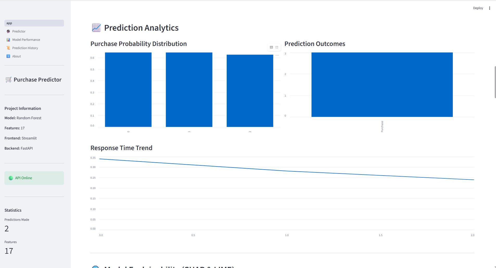
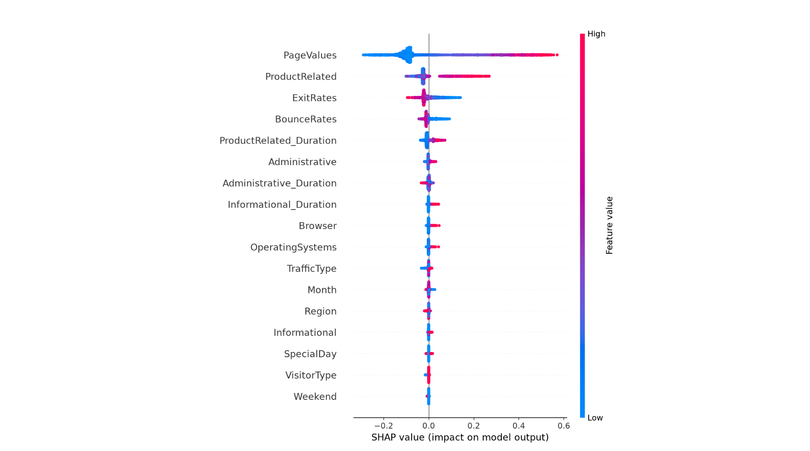
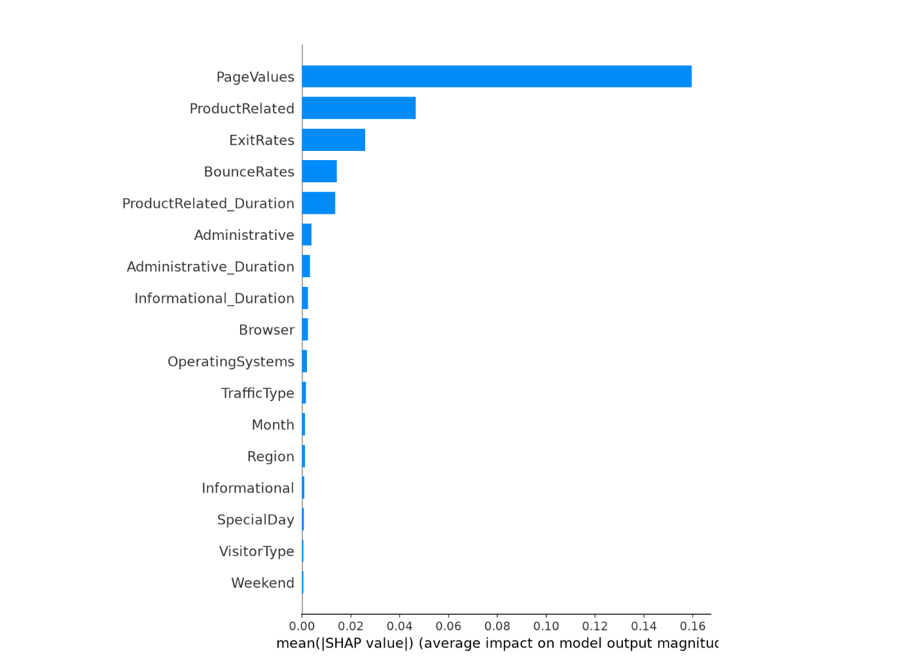
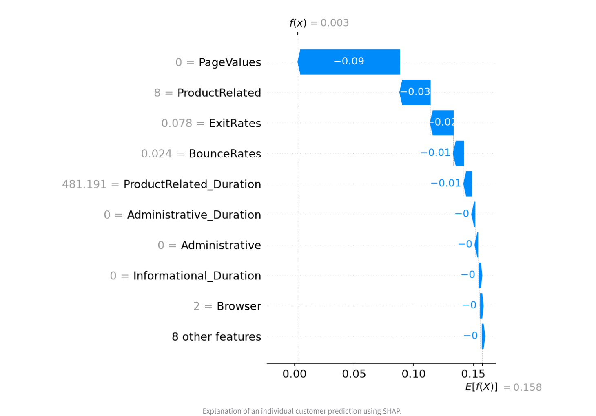
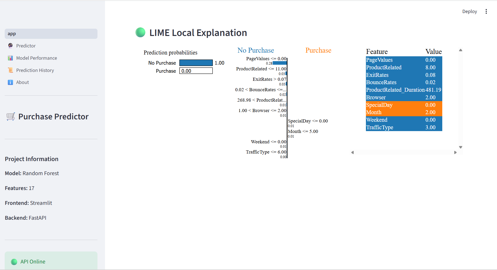

<div align="center">

# 🛒 Ecommerce Purchase Intent Prediction

### End-to-End Machine Learning Project using Random Forest, FastAPI, Streamlit, SHAP, LIME & MLflow

Predict whether an online customer session will result in a purchase using Explainable Artificial Intelligence.


</div>

---

# 📌 Project Overview

E-commerce businesses receive thousands of visitors every day, but only a small percentage complete a purchase.

This project predicts whether an online customer session will result in a purchase by leveraging Machine Learning and Explainable AI. The solution includes a production-style FastAPI backend, an interactive Streamlit dashboard, SHAP and LIME explainability, and MLflow experiment tracking.

---

# 💼 Why This Project?

This project demonstrates an end-to-end Machine Learning workflow from data preprocessing to deployment.

It showcases practical industry skills including:

- Data Cleaning
- Exploratory Data Analysis
- Feature Engineering
- Model Training
- Hyperparameter Optimization
- Explainable AI
- REST API Development
- Interactive Dashboard Development
- Experiment Tracking
- Production-ready Project Structure

---

## 📸 Dashboard Preview

| Home | Prediction |
|------|------------|
|  |  |

| History | SHAP Summary |
|------|------------|
|  |  |

| SHAP Importance | SHAP Local |
|------|------------|
|  |  |

### 🟢 LIME Local Explanation


---

# ✨ Features

- ✅ Real-time Purchase Prediction
- ✅ FastAPI REST API
- ✅ Interactive Streamlit Dashboard
- ✅ Prediction History
- ✅ Analytics Dashboard
- ✅ Random Forest Classifier
- ✅ SHAP Explainability
- ✅ LIME Local Explanations
- ✅ MLflow Experiment Tracking
- ✅ Download Prediction History
- ✅ Production-ready Project Structure

---

# 📊 Model Performance

| Model | Accuracy | Precision | Recall | F1 Score | ROC-AUC |
|------|---------:|----------:|--------:|---------:|---------:|
| Logistic Regression | 92.96% | 83.99% | 68.17% | 75.26% | 96.27% |
| Decision Tree | 89.25% | 65.62% | 66.31% | 65.96% | 79.92% |
| ⭐ Random Forest | **93.17%** | **81.23%** | **73.47%** | **77.16%** | **96.91%** |

---

# 🏆 Project Highlights

- End-to-End Machine Learning Pipeline
- Random Forest selected as the final model
- FastAPI Backend
- Streamlit Dashboard
- SHAP Explainability
- LIME Explainability
- MLflow Integration
- Interactive Analytics Dashboard
- Production-ready Folder Structure

---

# 🛠 Technology Stack

| Category | Technologies |
|-----------|-------------|
| Programming | Python |
| Data Analysis | Pandas, NumPy |
| Visualization | Matplotlib, Plotly |
| Machine Learning | Scikit-Learn |
| Explainability | SHAP, LIME |
| Backend | FastAPI |
| Frontend | Streamlit |
| Experiment Tracking | MLflow |
| Version Control | Git & GitHub |

---

# 📂 Project Structure

```text
Ecommerce-Purchase-Intent-Prediction/
│
├── dashboard/
│   ├── assets/
│   ├── components/
│   ├── pages/
│   ├── utils/
│   ├── app.py
│
├── data/
│
├── docs/
│
├── images/
│   └── screenshots/
│
├── mlruns/
│
├── models/
│
├── notebooks/
│
├── reports/
│
├── src/
│   └── api/
│
├── README.md
├── requirements.txt
└── LICENSE
```

---

# ⚙️ Installation

Clone the repository

```bash
git clone https://github.com/hardeepsingh2428/Ecommerce-Purchase-Intent-Prediction.git
```

Move into the project

```bash
cd Ecommerce-Purchase-Intent-Prediction
```

Create virtual environment

```bash
python -m venv venv
```

Activate virtual environment

Windows

```bash
venv\Scripts\activate
```

Linux / macOS

```bash
source venv/bin/activate
```

Install dependencies

```bash
pip install -r requirements.txt
```

---

# 🚀 Running the Project

## Start FastAPI

```bash
uvicorn src.api.main:app --reload
```

API Documentation

```
http://127.0.0.1:8000/docs
```

---

## Start Streamlit Dashboard

```bash
streamlit run dashboard/app.py
```

---

# 🧠 Explainable AI

The application includes multiple Explainable AI techniques.

## SHAP

- SHAP Summary Plot
- Feature Importance
- Local Explanation

## LIME

- Local Prediction Explanation
- Individual Prediction Interpretation

These techniques make model predictions transparent and trustworthy.

---

# 📈 MLflow

The project uses MLflow for:

- Experiment Tracking
- Parameter Logging
- Metric Logging
- Artifact Storage
- Model Comparison

---

# 📌 Future Improvements

- Docker Support
- Cloud Deployment
- CI/CD Pipeline
- User Authentication
- Batch Prediction API
- Kubernetes Deployment

---

# 🌐 Live Demo

**Streamlit Dashboard**

Coming Soon

**FastAPI API**

Coming Soon

---

# 👨‍💻 Author

## Hardeep Singh

**MBA – Data Science & Artificial Intelligence**

**Chandigarh University**

### Connect with me

**LinkedIn**

https://www.linkedin.com/in/hardeep-singh-282653322

**GitHub**

https://github.com/hardeepsingh2428

---

<div align="center">

⭐ If you found this project useful, consider giving it a star.

</div>
